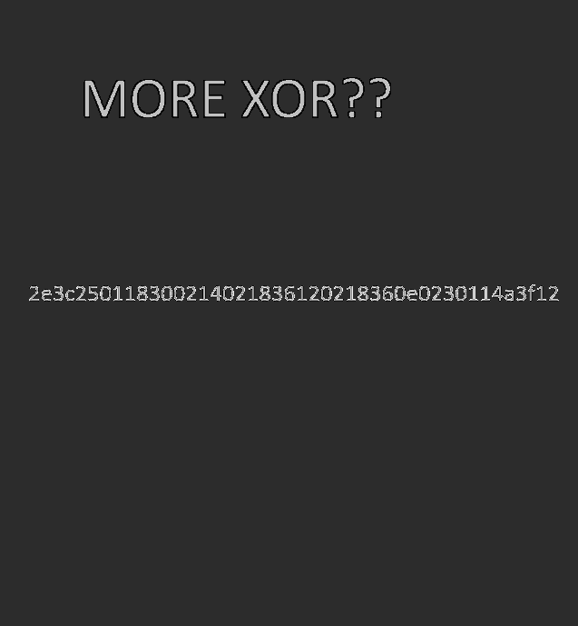
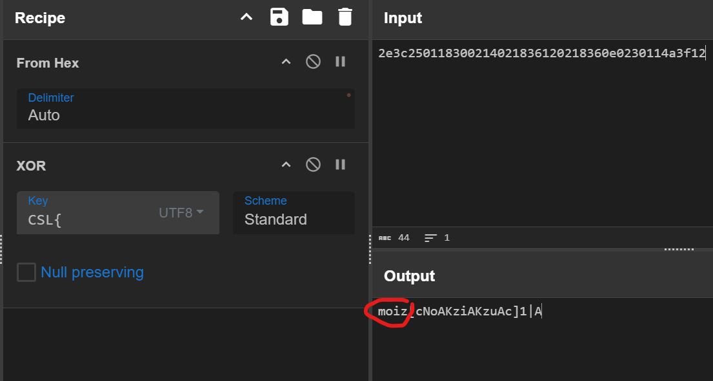
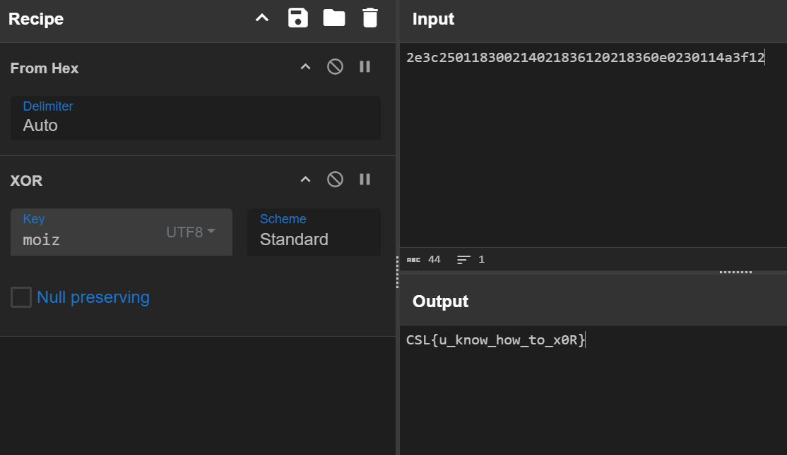

## Challenge: PixelPad

**Description:**  
"What gibberish is this?"  

**Files Provided:**  
- `gibber1.png`  
- `gibber2.png`

---

## Solution:

From the name of the chal Pixel**Pad**, we can infer that the images are encrypted using a **One-Time Pad (OTP)**. So we can XOR them together to cancel out the key.

Python script to XOR the images in **grayscale**:

```python
import cv2
import numpy as np

def xor_images(image1_path, image2_path, output_path="xored_output.png"):
    # Load encrypted images as grayscale
    enc1 = cv2.imread(image1_path, cv2.IMREAD_GRAYSCALE)
    enc2 = cv2.imread(image2_path, cv2.IMREAD_GRAYSCALE)

    if enc1 is None or enc2 is None:
        raise ValueError("Error loading images. Check file paths!")

    if enc1.shape != enc2.shape:
        raise ValueError("Images must have the same dimensions for XOR operation.")

    # XOR both encrypted images (C1 ⊕ C2 = P1 ⊕ K ⊕ P2 ⊕ K = P1 ⊕ P2)
    xored_output = cv2.bitwise_xor(enc1, enc2)

    # Save the result
    cv2.imwrite(output_path, xored_output)
    print(f"XOR operation complete! Output saved as '{output_path}'.")

xor_images("image1.png", "image2.png")
```
---
After running the script, we get the output image `xored_output.png`.



Open xored_output.png and you'll see some hex values.
`2e3c250118300214021836120218360e0230114a3f12`

Take this hex value and input into CyberChef.\
XOR the hex value with the flag format `CSL{` to get the key.



The repeating key is revealed as "moiz". And using this key we can decrypt the message and get the flag!!


