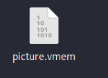
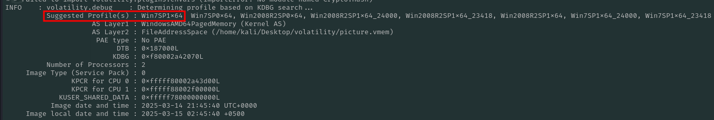
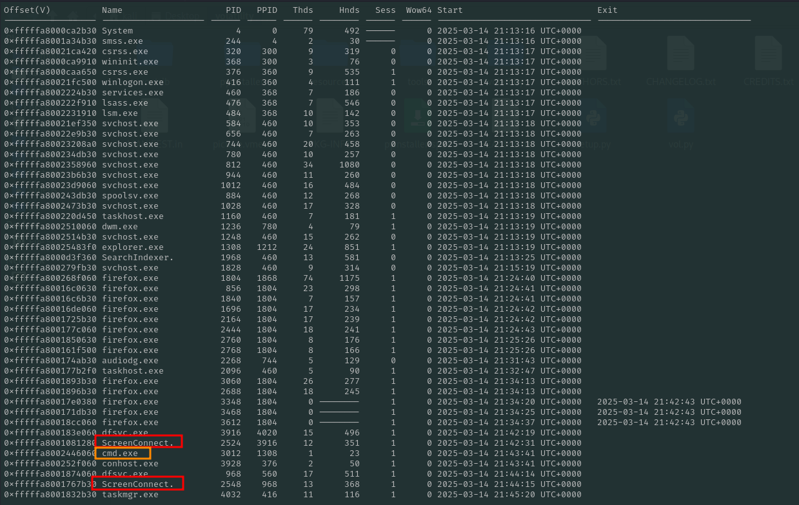
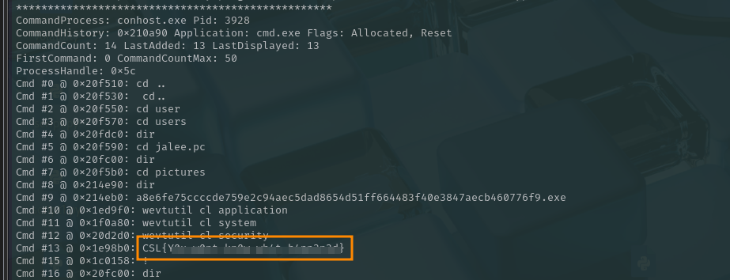

## Challenge Name: Gone but Not Forgotten

### Category: Forensics

### Description:
 Our SOC Team has detected some suspicious activity on one of our machines. Can you help us find out what's going on?

---

## Solution

### Step 1: Understanding the Challenge
The file we have is ".vmem" extension file which is vmware produced memory file an active machine.

These types of files are easily analyzed with the help of volatitlity Linux/Windows.

### Step 2: Getting Image Information
We extract the information of the OS by using volatiltiy. 

```bash
python2 vol.py -f picture.vmem imageinfo
```

This gives us the profile of the image which we add in coming commands for effective retrieval of the information.
### Step 4: Flag Retrieval
Next, we check the processes with pslist utlity within volatility.

```bash
python2 vol.py -f picture.vmem --profile Win7SP1x64 pslist
```


We see two processes 'ScreenConnect.exe' which are not the usual processes in Windows7. These processes are used to get remote connection to a machine so this is a suspicious process.
We also see cmd.exe in the process list which is not very unusual but still worth looking.

```bash
python2 vol.py -f picture.vmem --profile Win7SP1x64 cmdscan
```
which lists all the commands entered in the cmd. Running this command shows us that the threat actor tried to run the malware and remove event logs and just at the end we see the flag.


---

## Flag
```
CSL{Y0---------------3d}
```


---
