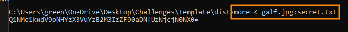

# CTF Challenge Writeup: Mysterious Veil

We are given an image galf.jpg having alphabets in order with no actual information.

```bash
strings galf.jpg | grep 'CSL'
```
give no output. 

Upon using exiftool I see the unsual size of the file for the pixel ratio.


This led me to believe that it might contain Alternate Data Strem to hide some information.

---

## Solution

Turns out the file was actually large but still it contained an ADS. I was lucky with this because next steps were very easy.
- Extract the flag using more utility.

- The flag seems to be base64 encoded just needed to paste it in cyberchef which automatically detects the encoding and decoded the flag.

