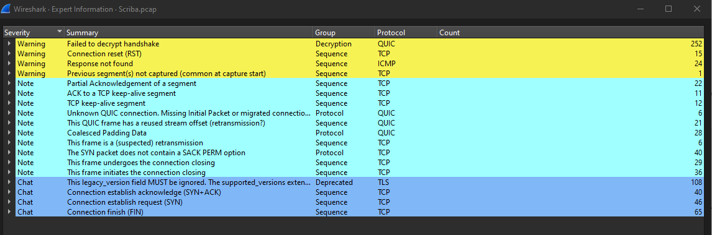
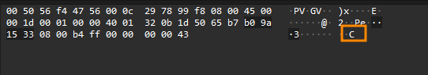
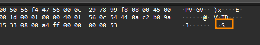
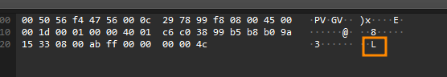
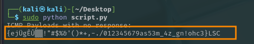
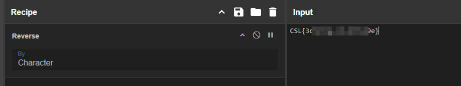

# CTF Challenge Writeup: Scriba

## Solution
Given a pcap file. Its natural to directly open it in wireshark.

### Step 1: Starring Contest
We just scroll thorugh the file to see if we can find the some pattern in the packets information or protocol but that takes too much time instead we go to 
> Anayze > Expert Information 
Where we are given all the packets with similarities filtered.


Using the 'Apply Filter' one by one from top to bottom we find a pattern in ICMP with <B> No Response Found </B> we see that there is one byte payload in each of the packet. And upon closer look the flag was scattered in these packets.




### Step 2: Tools and Techniques Used
After this it was simple. We needed to extract the contents of the ICMP packets.
For that I used a script to extract the flag.

```python
from scapy.all import rdpcap, ICMP

def extract_icmp_requests(pcap_file):
    # Read the pcap file
    packets = rdpcap(pcap_file)
    icmp_requests = []
    icmp_responses = set()

    # Iterate through packets to identify ICMP requests and responses
    for packet in packets:
        if ICMP in packet:
            # Check if it's an ICMP Echo Request
            if packet[ICMP].type == 8:  # Type 8 is Echo Request
                icmp_requests.append(bytes(packet[ICMP].payload))
            elif packet[ICMP].type == 0:  # Type 0 is Echo Reply
                # Identify responses based on the identifier and sequence number
                identifier = packet[ICMP].id
                sequence = packet[ICMP].seq
                icmp_responses.add((identifier, sequence))

    # Filter out requests that have responses
    unmatched_requests = []
    for pkt in packets:
        if ICMP in pkt and pkt[ICMP].type == 8:  # Check if it's a request again
            identifier = pkt[ICMP].id
            sequence = pkt[ICMP].seq
            if (identifier, sequence) not in icmp_responses:  # No response
                unmatched_requests.append(bytes(pkt[ICMP].payload))

    return unmatched_requests

def main():
    pcap_file = 'path/to/your/file.pcap'  # Change this to your pcap file path
    payloads = extract_icmp_requests(pcap_file)

    # Print payloads in one line
    if payloads:
        joined_payloads = b''.join(payloads).decode('latin1')  # Decode using 'latin1' to handle byte data
        print(f"ICMP Payloads with no response:\n{joined_payloads}")
    else:
        print("No ICMP requests with no response found.")

if __name__ == "__main__":
    main()
```
 This gives a string that contains flag with some garbage string. 


Pasting this string on *cyberchef* and removing the garbage strings we get the flag.


