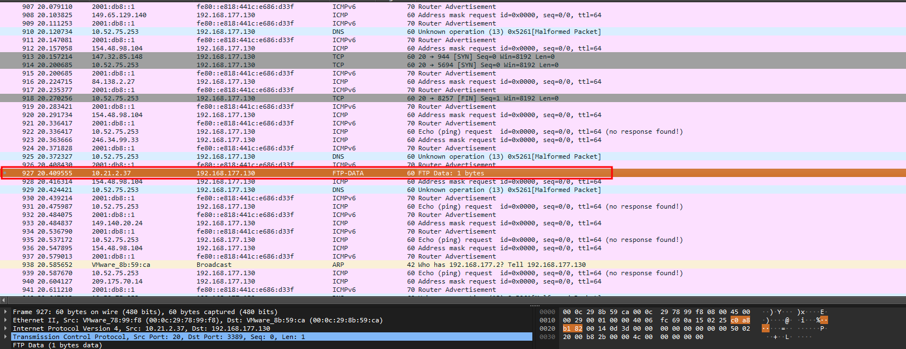
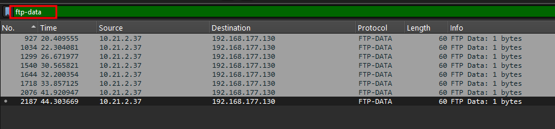
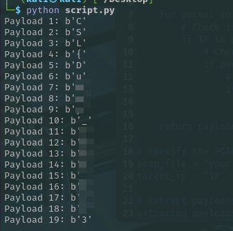

## Challenge Name: Spikes and Fires


---

## Description
This was just a regular day at the office, but our intern thinks this was something else. Prove him wrong by analyzing the provided file.

---
A PCAP file to analyze and find the flag.
## Solution
Opening in Wireshark
> Analyze > Expert Information

to see different type of packets having similaritites between them but was not able to find anything useful.

Also tried to search the 'CSL' but the flag seems to be scattered or encrypted.
SO it was manual analysis of the packets until we find some hint.

After scrolling for sometime we see a protocol that wasnt in Expert Information



I filtered the packets based on that protocol and it showed a scattered flag but it wasnt a full flag.


Next, I filtered based on the IP which was common for FTP-DATA protocol and it contained the full flag next step was to make a script and extract the flag using scapy.


```python
from scapy.all import rdpcap, IP

def extract_payload_from_pcap(pcap_file, target_ip):
    packets = rdpcap(pcap_file)
    payloads = []

    for packet in packets:
        # Check if the packet has an IP layer
        if IP in packet:
            # Check if the source or destination IP matches the target IP
            if packet[IP].src == target_ip or packet[IP].dst == target_ip:
                # Extract raw payload (assuming TCP/UDP)
                if hasattr(packet, 'load'):
                    payloads.append(packet.load)

    return payloads

# Specify the PCAP file path and the target IP
pcap_file = 'your.pcap'  # Replace with your PCAP file path
target_ip = 'IP'               # Replace with the target IP address

# Extract payloads
extracted_payloads = extract_payload_from_pcap(pcap_file, target_ip)

# Print extracted payloads
for idx, payload in enumerate(extracted_payloads):
    print(f"Payload {idx + 1}: {payload}")
```
This script extracts the payload of a packet based on certain IP address and this gave us the flag.



