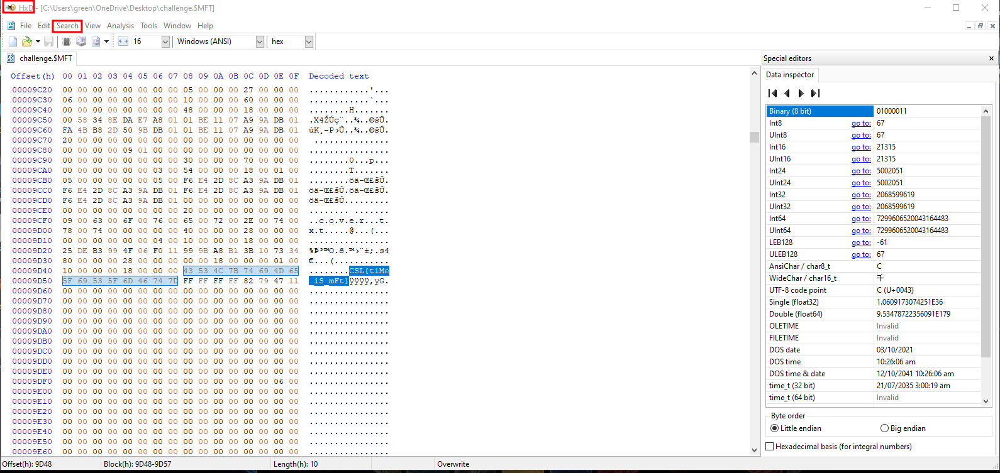

# CTF Writeup: Timemachine

**Description:**  
Our BYTE nation carries a flag from the past to the future. Can you find the history of our flag?

---

## Solution

### Analysis
The description says something of a flag so I guessed there might be a flag. 
I did *strings* in linux with CSL as grep and there was indeed a flag.

but we need to find the something else for this and flag format was a date so we needed to find a date related to the flag and the flag had a hint of time.

At this point it seemed that i need to find the flag within a Hex Editor.
I used HxD for this.

Next step was to search for the flag to see where it resides. And it resides in a file **cover.txt**

Analyzing the timestamps of this file there was one timestamp that was of 1980 which i knew would be the flag because every other timestamp was of 2025.

---