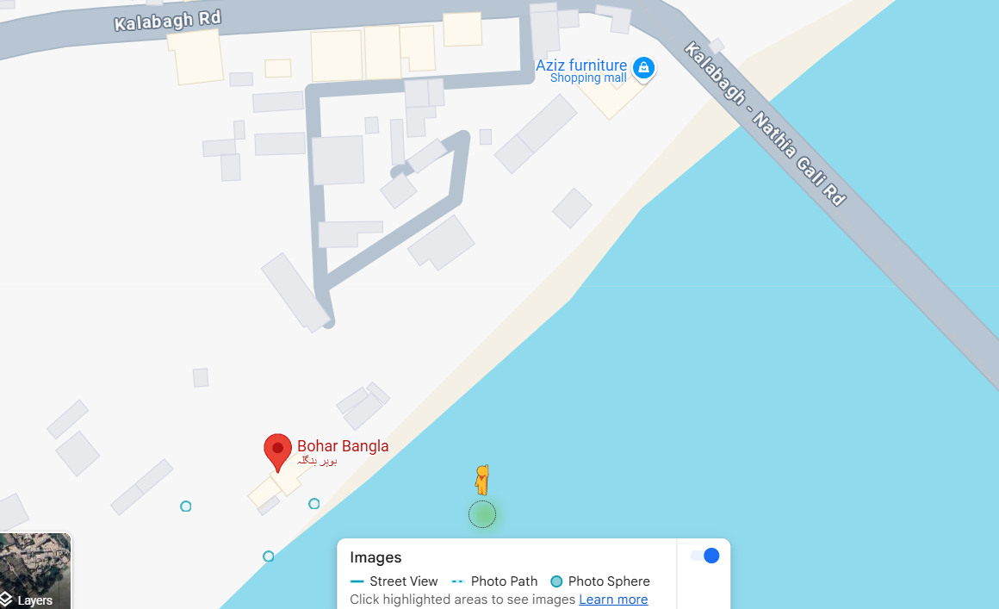

# Writeup for OSINT Challenge - Bait & Dine-II

## Challenge Breakdown

The given challenge provides a scenario where an investigator was tracking a scammer along a river. The last message received mentioned key elements:

1. **"He’s heading toward a place where the water turns brackish…"**

   - This suggests a location where freshwater meets saltwater, often near an estuary or a confluence.

2. **"Something about an old estate…"**

   - This hints at a historically significant or well-known structure in the area.

3. **"He’s trying to escape by boat!"**

   - Indicates proximity to a river or lake with boat access.

4. **The final image contained a bridge in the corner.**

   - This is a crucial visual clue that can be used for verification.

## Finding the Location

By combining these clues, we can narrow down the search to **Kalabagh**, a well-known region in Pakistan with a river and brackish waters nearby. Further investigation on Google Maps reveals a few significant viewpoints in Kalabagh.

One of the notable viewpoints is **Bohr Bangla**, which matches the visual and descriptive clues from the challenge. By examining this location in **Google Maps Street View or satellite imagery**, we can verify that the viewpoint and bridge in the image align with those seen at Bohr Bangla.

```

```

## Extracting the Coordinates

Upon identifying Bohr Bangla, we can retrieve its exact latitude and longitude from Google Maps. These coordinates complete the flag format:

```
CSL{bohar_bangla_XX.XXXX_YY.YYYY}
```

where **XX.XXXX** and **YY.YYYY** are the precise latitude and longitude values.

```


```
The picture clearly shows the matching bridge and the point.

## Conclusion

This challenge demonstrates an effective OSINT investigation by leveraging geographical hints, Google Maps viewpoints, and real-world reconnaissance techniques to pinpoint the final location of the investigator before they went silent. Combining textual analysis and image verification leads to the correct identification of **Bohr Bangla, Kalabagh** as the scammer’s escape point.


