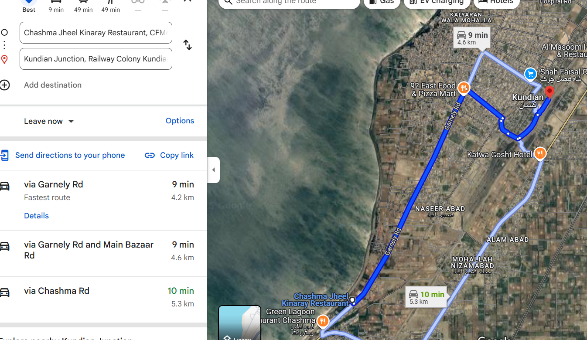

# 🕵️‍♂️ Riverside Ruse - OSINT Challenge Write-Up  

## **Challenge Overview**  
In this OSINT challenge, we need to identify three key locations based on limited clues:  
1. **An expensive restaurant** near a small restaurant.  
2. **The nearest hospital** where the suspect works.  
3. **The closest train station**, which he might use to escape.  

### **Given Clues:**  
- The **small restaurant’s name** is inspired by a **lake**, and its name is written on the wall.  
- The **Urdu letter "چ" (Chay)** is visible on the wall, indicating the name starts with **"Ch"**.  
- The suspect is near **a river/lake**, confirmed by **background water sounds** and a **satellite image**.  
- The language clue suggests the country is **Pakistan**.  

---

## **Step 1: Identifying the Small Restaurant**  
1. Since the name is inspired by a lake and starts with "Ch," we search for **lakes in Pakistan that start with "Ch"**.  
2. **Chashma Lake** is a strong match.  
3. Cross-referencing with **Google Maps & Street View**, we find **"Chashma Jheel Kinaray Restaurant."**  

### 📌 Screenshot: Urdu Letter "چ" on the Restaurant Wall  
  

### 📌 Screenshot: Satellite Image Confirming Riverside Location  
  

### 📌 Screenshot: Google Maps Showing "Chashma Lake View Restaurant"  
  

---

## **Step 2: Finding the Expensive Restaurant Nearby**  
1. Checking Google Maps for **higher-end restaurants** near **Chashma Lake View Restaurant**.  
2. The **"Green Lagoon Restaurant"** is identified as a more expensive dining option.  

### 📌 Screenshot: Google Maps Result for "Green Lagoon Restaurant"  
  

---

## **Step 3: Locating the Nearest Hospital**  
1. Searching for hospitals near **Chashma Lake**, we find **"Khadija Hospital."**  

### 📌 Screenshot: Google Maps View of Khadija Hospital  
  

---

## **Step 4: Finding the Nearest Train Station**  
1. Since the suspect may **escape by train**, we search for **the closest train station** near Chashma Lake.  
2. The nearest station is **Kundian Junction**.  

### 📌 Screenshot: Google Maps View of Kundian Junction  
  

---

## **Final Flag Format**  
With all locations identified, the final flag is:  
```plaintext
CSL{GreenLagoonResturant_KhadijaHospital_KundianJunction}
