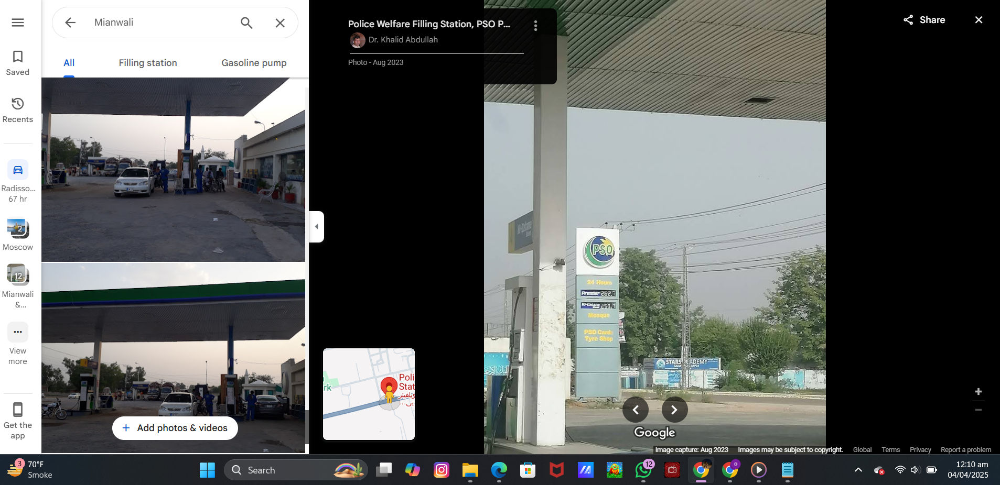
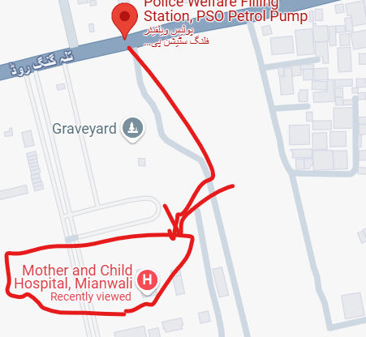
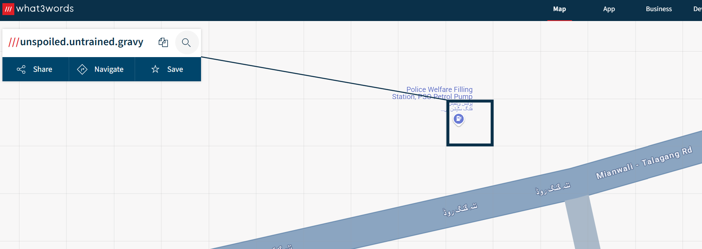

# **OSINT Challenge: "First Aid Required, ASAP"**

## **Writeup:**

1. **Analyze the image**  
   Upon examining the image, we can clearly see that the police officers are wearing uniforms that resemble those of the **Punjab Police**. This is a clue that the location is likely somewhere in Punjab. Additionally, the image is taken while standing at a **petrol pump**, which narrows down the area further.

2. **Look for the 'Stars Academy' board**  
   A prominent detail in the image is the visible board of **Stars Academy**. This gives us a clear clue to start searching for all **Stars Academies** in **Punjab**. After some time spent searching, we find that there is a **Stars Academy** located in **Mianwali**, which is a city in **Punjab**. Furthermore, we spot a **PSO filling station** near it.

 
3. **Match the filling station location**  
   Looking up the **PSO filling station** near **Stars Academy Mianwali** on **Google Maps**, we find that the filling station in the pictures from **Google Maps** closely resembles the one in the image provided. This confirms the location of the academy and the filling station.

   **Screenshot Placeholder:**  
   

4. **Find the nearest hospital**  
   After identifying the location, we use **Google Maps** to find the nearest hospital. We locate **Mother and Child Hospital** as the closest hospital to **Stars Academy** and the **PSO filling station**.

   **Screenshot Placeholder:**  
   

5. **Find the exact location using What3Words**  
   Finally, we use **What3Words** to pinpoint the exact location of the **PSO filling station**. The three-word location is **unspoiled.untrained.gravy**.

   **Screenshot Placeholder:**  
   

---

