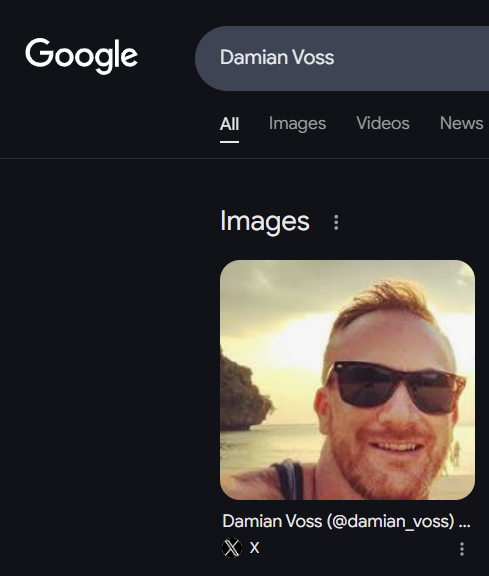
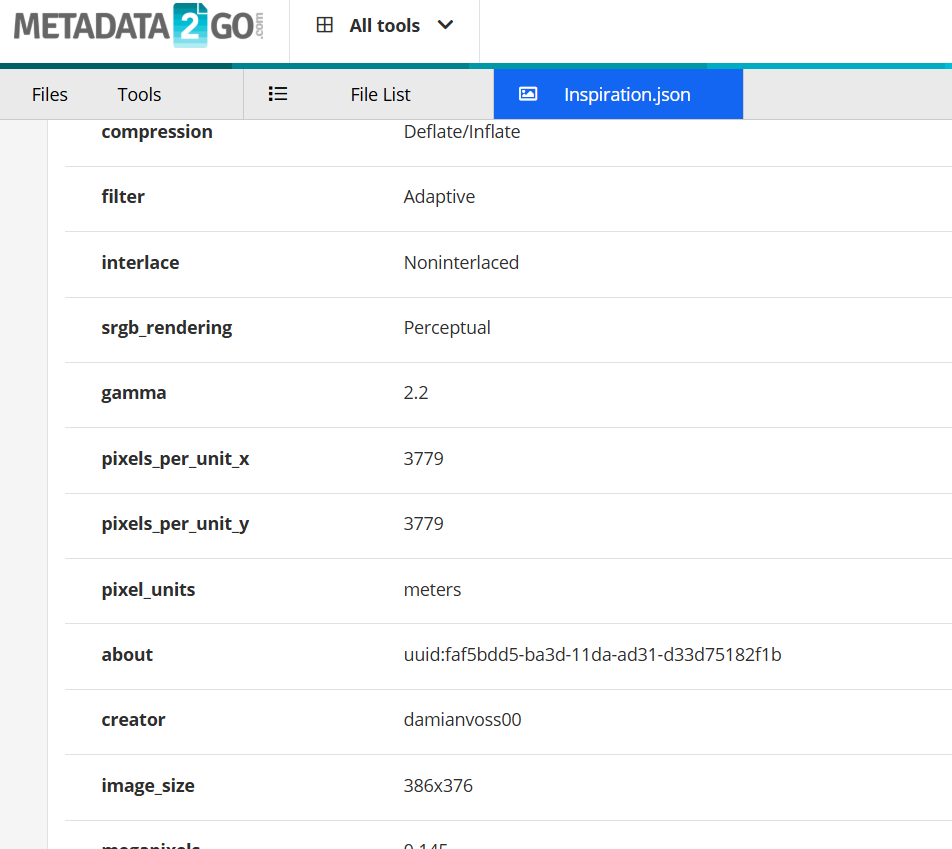
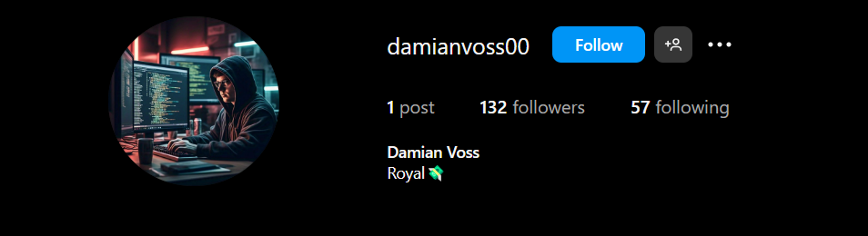
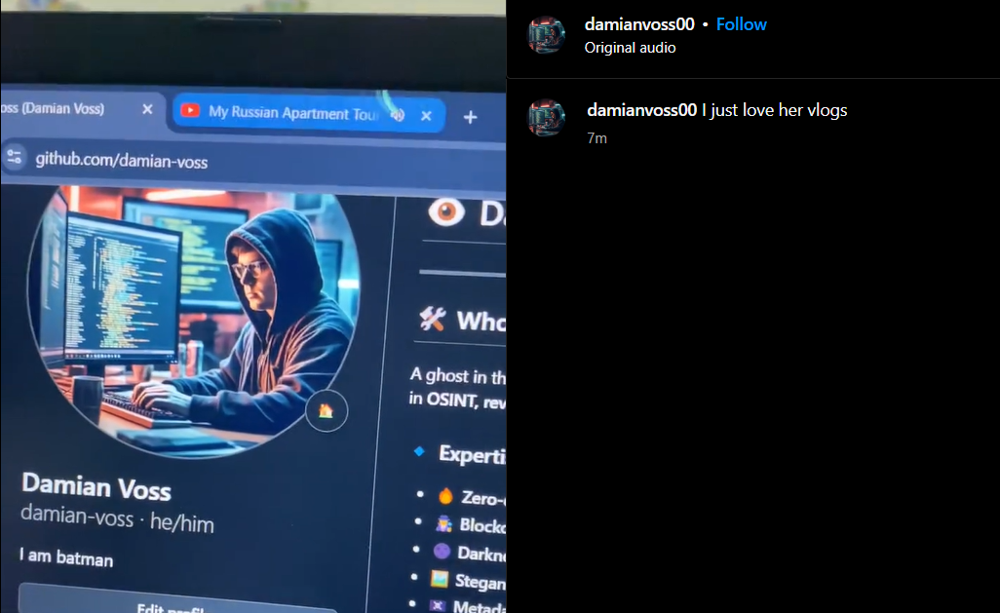
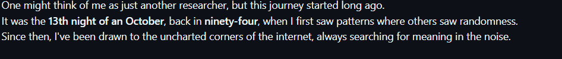
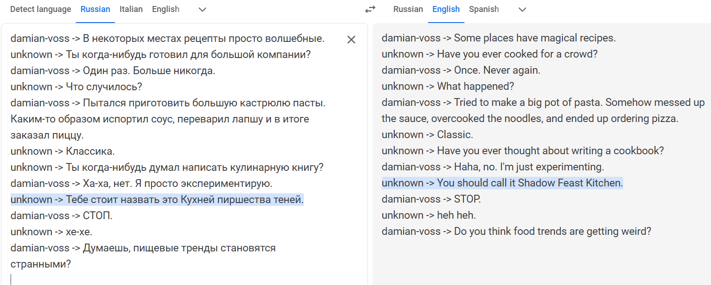
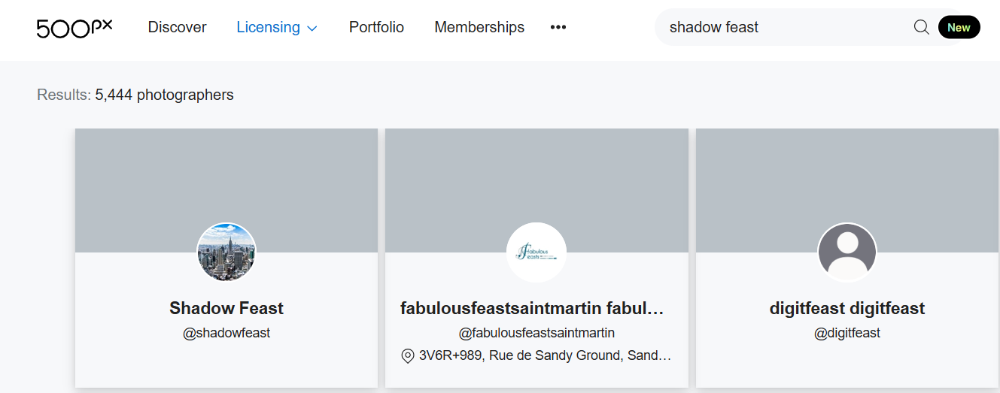
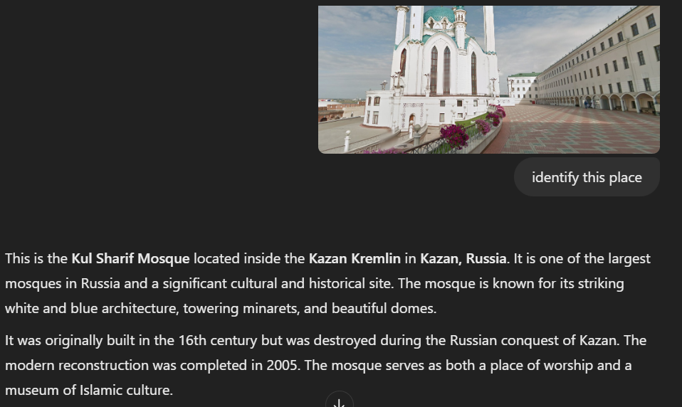
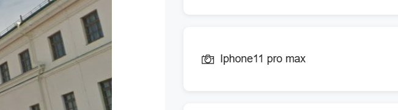

# 🕵️ OSINT Challenge: **The hidden Hatchling**  

## 📝 Challenge Description  
A hacker—or should we say, an *aspiring* one—thought it was cool to take inspiration from someone else’s name. But in the process, he left behind a trail of breadcrumbs leading straight to his real identity. Your mission? Find out his **username**, **date of birth**, **city of residence**, and **mobile device model** using pure OSINT skills.  

**Flag Format:**  
CSL{username_dd_mm_yyyy_cityname_mobilephonemodel}

---

## 🕵️ Step-by-Step Writeup  

### **1️⃣ Finding the Name**  
The first clue was a **picture of a person**. A simple reverse image search on Google led to the name **Damian Voss**.  
📌 *However, the challenge description made it clear—this isn't the real person!*  

➡️ **Next Step:** If this isn’t the hacker’s real name, where else does it show up?  

📌  

---

### **2️⃣ Checking for Accounts**  
Naturally, the next step was to search for **Damian Voss** on social media platforms and other sites. But here’s the twist:  

❌ No accounts could be found under that exact name!  

➡️ **Next Step:** What if the image itself holds a hidden clue?  

---

### **3️⃣ Extracting Metadata**  
Checking the **metadata (EXIF data) of the image**, a new detail emerged:  

📌 **Author Name:** `damianvoss00`  

📌  

➡️ **Next Step:** Searching this username on social media.  

---

### **4️⃣ Finding the Instagram Profile**  
By searching **damianvoss00** on **Instagram**, we found an account!  

📌  

➡️ **Next Step:** Time to check the posts for clues.  

---

### **5️⃣ Hidden Clue in a Reel**  
Scrolling through the hacker’s Instagram, we found a **reel where he’s watching vlog**. But more importantly:  

📌 In the reel he accidently revealed his github!  

📌   

➡️ **Next Step:** Investigate the GitHub profile.  

---

### **6️⃣ Extracting the Date of Birth**  
Upon visiting **his GitHub profile**, we found a **README.md** file with detailed personal information.  

📌 Hidden within a paragraph, his **date of birth** was subtly mentioned:  
💡 *“It was the 13th night of an October, back in ninety-four.”*  

📌   

➡️ **Date of Birth:** `13_10_1994`  

---

### **7️⃣ Finding the Hacker Username**  
Checking his repositories, one stood out—**“Importance of Relationships”**, which seemed unrelated to his usual coding projects.  

📌 Inside this repo was a **chat log** in Russian.  

📌 After translating, at one point, the other person called him:  
💡 *"ShadowFeast’s Kitchen"*  

📌   

➡️ **Hacker Username:** `ShadowFeast`  

---

### **8️⃣ Finding His City**  
Now, the goal was to find his **location**. Since he was a photographer, we searched for his username **"ShadowFeast"** on various photography platforms.  

📌 After checking **Flickr, Unsplash, and 500px**, we found his account on **500px**.  

📌 There, he had uploaded **multiple photographs**, including one with a caption in Russian:  
💡 *“My hometown has many beautiful places to visit.”*  

📌  

➡️ **Next Step:** Reverse image search that **mosque picture**.  

📌 The search results identified the mosque as being in **Kazan, Russia**.  

📌  

➡️ **City:** `Kazan`  

---

### **9️⃣ Finding His Mobile Device**  
Looking deeper into the **image info on 500px**, we found:  

📌 **Camera/Device Used:** `iPhone 11 Pro Max`  

📌   

➡️ **Mobile Model:** `iPhone11ProMax`  

---

## 🎯 Final Flag  
With all details collected, the final flag is:  

CSL{ShadowFeast_13_10_1994_Kazan_iPhone11ProMax}

✅ **Mission Accomplished!** 🎉  
