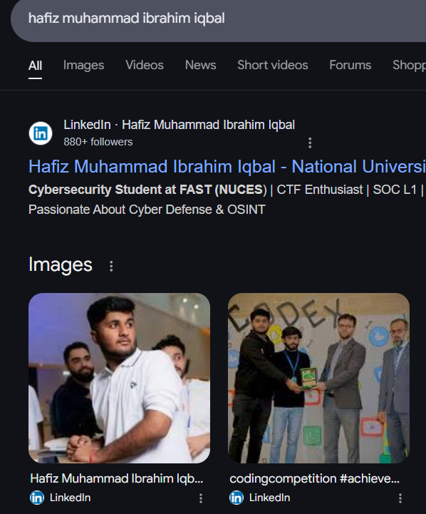
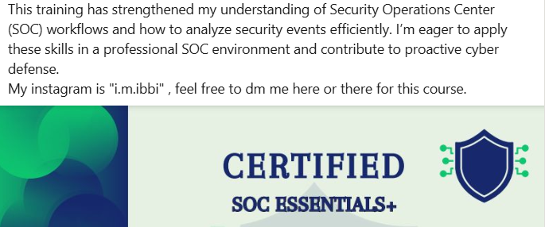
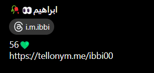
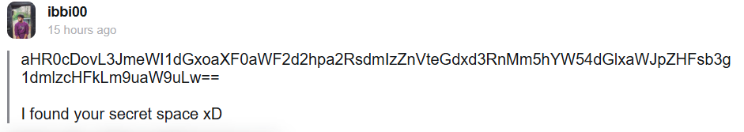
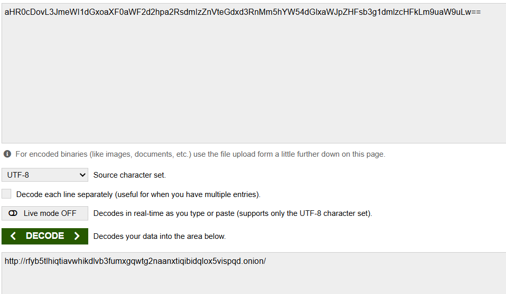
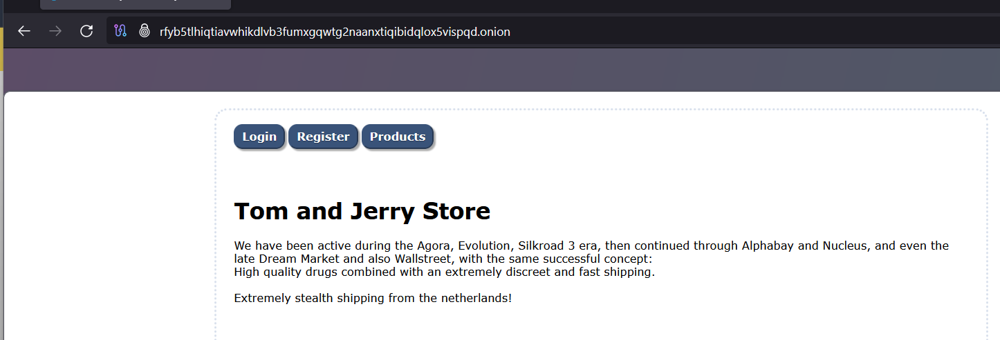

# Writeup for OSINT Challenge - Who is Ibrahim?

## Challenge Breakdown

The given challenge provides a scenario involving an individual named **Hafiz Muhammad Ibrahim Iqbal**, who has been making questionable online purchases and trying to hide his tracks. Our task is to identify the **name of the online store** and the **country it operates from**.

## Step 1: Searching for the Name

The first clue is the **full name** provided in the challenge description: **Hafiz Muhammad Ibrahim Iqbal**. Since the image contains no useful information, we begin by performing a **Google search** on this name.

### Google Search Findings:
- One of the first results leads to the **LinkedIn profile** of the individual.

```

```

## Step 2: Checking the LinkedIn Profile

Upon visiting the **LinkedIn profile**, we examine the **latest posts** made by the individual.

- In the **description** of the most recent post, there is a **mention of an Instagram account** at the end.

```

```

## Step 3: Investigating the Instagram Account

Upon visiting the **Instagram account**, we find various posts, but one key detail stands out:

- The **bio** of the Instagram profile contains a **Tellonym link**.

```

```

## Step 4: Exploring the Tellonym Profile

Tellonym is a platform where users can **answer anonymous questions**. Since the individual is engaging in illegal activities, there is a chance they left some traceable information here.

- By scrolling through the **Tellonym page**, we find one tell containing a **Base64-encoded string**.

```

```

## Step 5: Decoding the Base64 String

Using any **Base64 decoder**, we decode the string and find that it leads to a **.onion link**, which is a dark web marketplace.

```

```

## Step 6: Accessing the Dark Web Marketplace

To visit the **.onion link**, we use the **Tor browser** to establish a connection and open the hidden website.

- The marketplace name displayed on the site is **TomAndJerry**.
- The marketplace **bio** mentions: *"Stealthy shipping from the Netherlands"*, confirming the country of operation.

```

```

## Extracting the Flag

From our investigation, we obtain the required details:

- **Store Name**: TomAndJerry
- **Country of Operation**: Netherlands

Thus, the flag format becomes:

```
CSL{TomAndJerry_Netherlands}
```

## Conclusion

This challenge demonstrates effective OSINT techniques by leveraging search engines, social media profiles, and deep web reconnaissance to trace an individual's hidden activities. By carefully following digital footprints, we successfully identified the online store and its country of operation.

