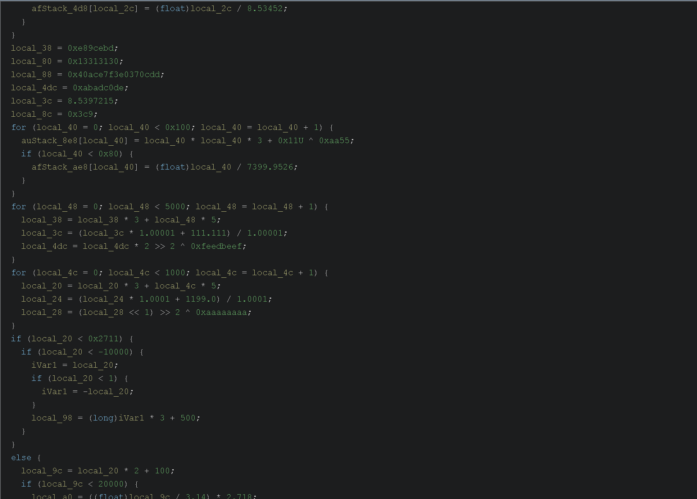
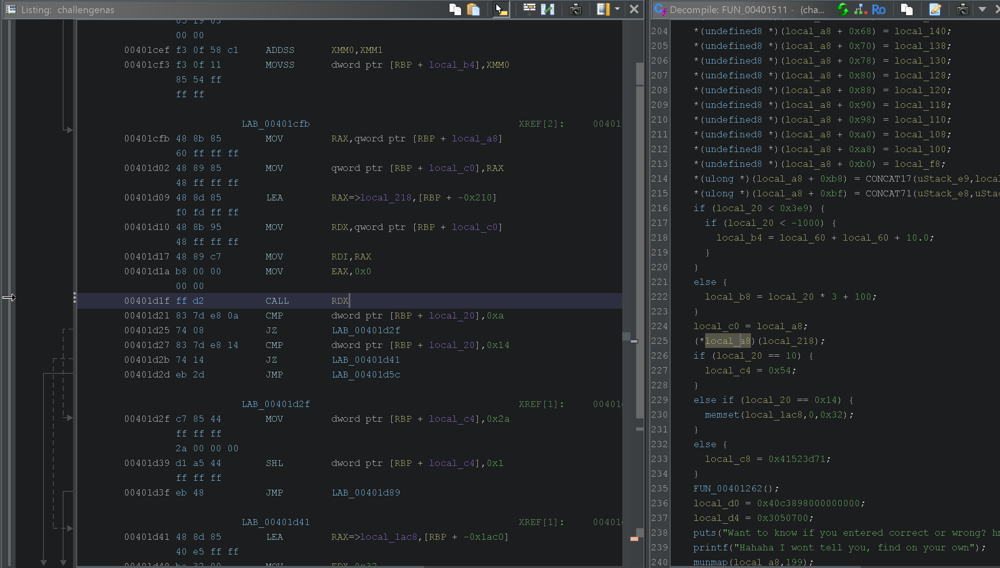
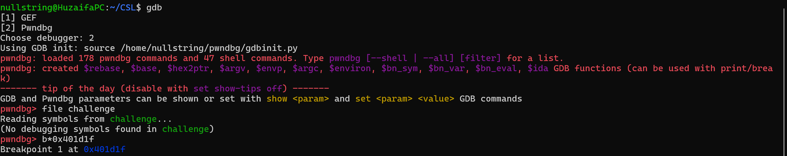
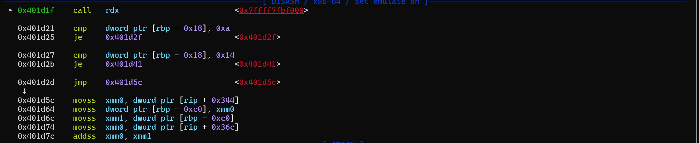
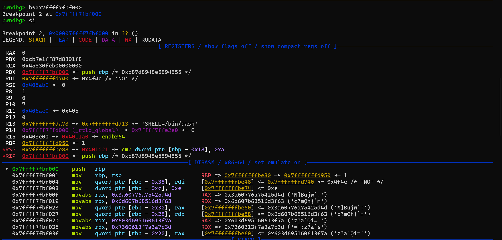
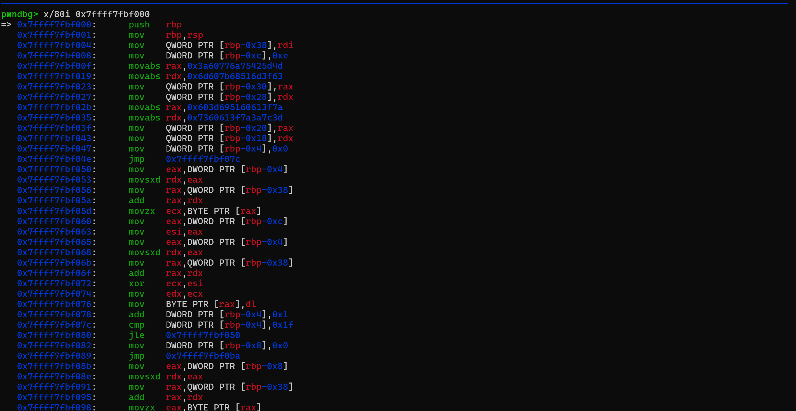
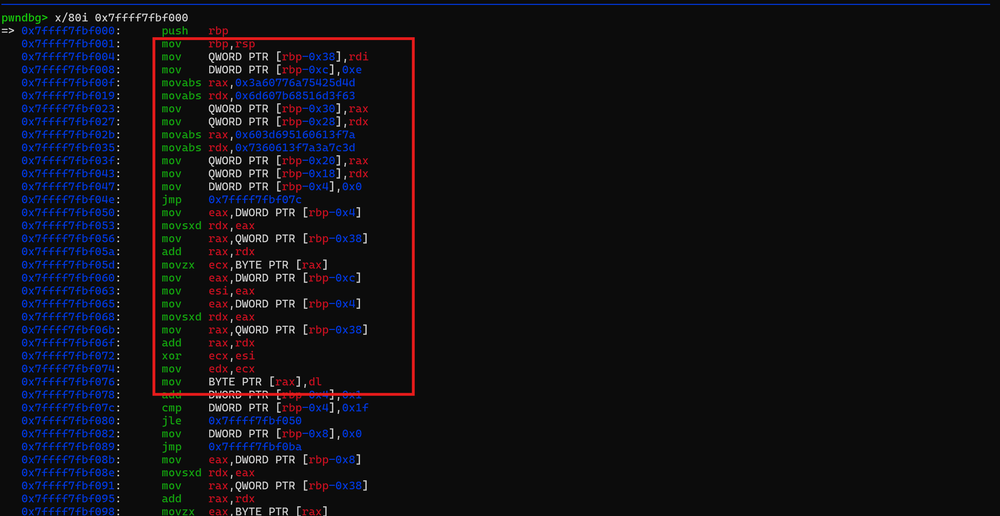

# Challenge Writeup

## Step 1: Open the Challenge File in Ghidra

Load the binary into Ghidra and analyze it. You'll notice a lot of dead code, making it harder to identify the main logic.



---

## Step 2: Identify Suspicious Dynamic Function Call

After analyzing the code, look for indirect function calls. A suspicious function call using a register (e.g., `call RDX`) appears.



---

## Step 3: Debugging in GDB

Open the binary in GDB and set a breakpoint at `call rdx` to inspect the function being dynamically called:

```sh
pwndbg> b *0x401d1f
pwndbg> run
```

- This will show which function is being resolved dynamically.

 
- Put Breakpoint on the dynamic function address.
 
- And ```si``` to step into the dynamic function.
 
- Now by ```x/80i 0x7ffff7fbf000```  We can see what the function is doing.
 

---

## Step 4: Analyzing XOR Logic

Upon further inspection, the function reveals an XOR-based validation. Extract the XOR key and the encrypted hex values.



---

## Step 5: Creating a Solver

Using the extracted XOR key and encrypted data, write a Python script (`solver.py`) to decrypt the flag:

Solver script can be found here: [solver.py](solver.py)

---

## Step 6: Obtain the Flag

Run `solver.py` to get the decrypted flag.

```sh
python3 solver.py
```
```python
Decrypted: CSL{dyn4m1c_funct1on_g3n3r4t1on}
```
---


