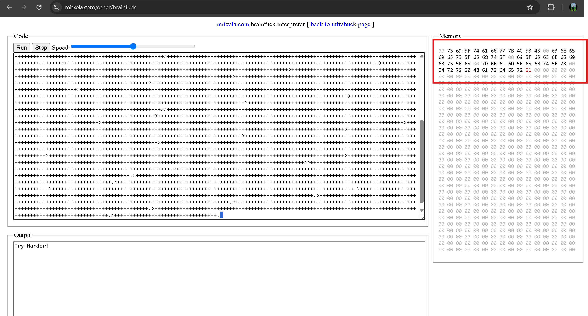

# Challenge Writeup

## Challenge Overview
In this challenge, you are given a Brainfuck program that, when executed, scrambles the flag and stores it in memory. The goal is to extract and reverse-engineer the flag from memory after running the code.

## Solution Approach

### Step 1: Running the Brainfuck Code
1. Navigate to [mitxela's Brainfuck Interpreter](https://mitxela.com/other/brainfuck).
2. Paste the provided Brainfuck code into the interpreter.
3. Execute the code and observe the memory state.
4. Copy the memory content after execution.

**Screenshot of Brainfuck Interpreter Execution:**




### Step 2: Writing a Script to Decode the Flag
Once we obtain the scrambled flag stored in memory, we need to write a script to reverse the scrambling process and recover the original flag.

**Extracted Memory Content:**
After converting hex to ascii:
 ``**si_tahw{LSCcneics_eht_i_ecneics_e}nam_eht_s**``

## Full Solution Code
You can find the full solution script here:
[solve.py](solve.py)

After Executing the script flag appears

``` python
Flag: CSL{what_is_the_science_science_is_the_man}
```

