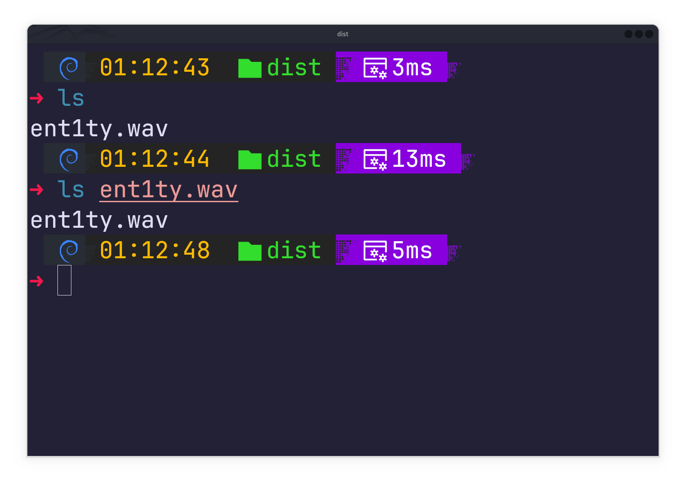
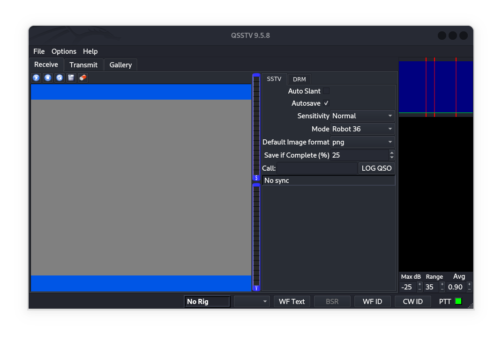
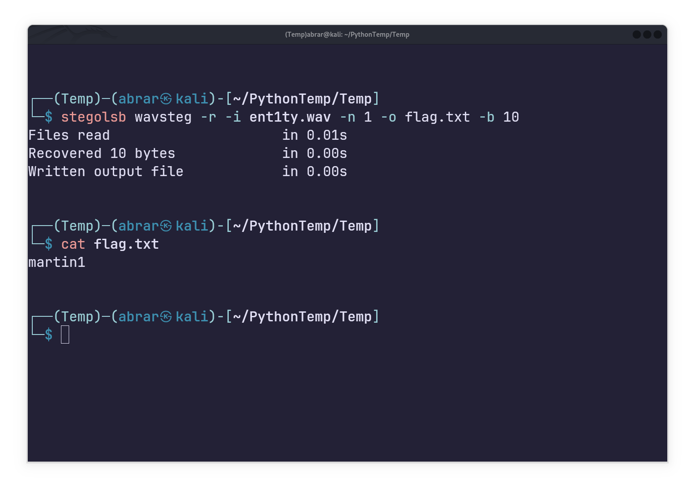
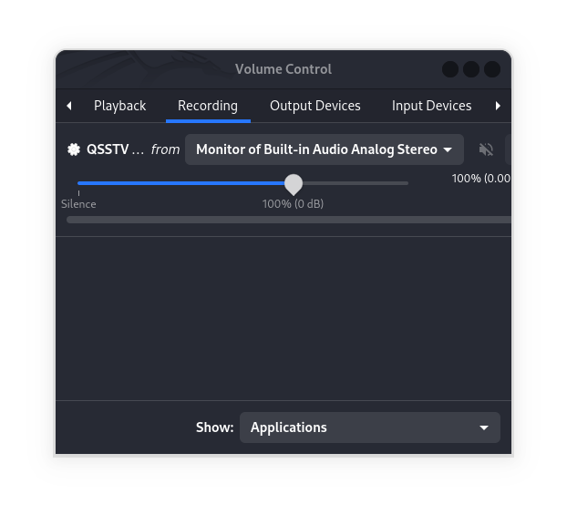
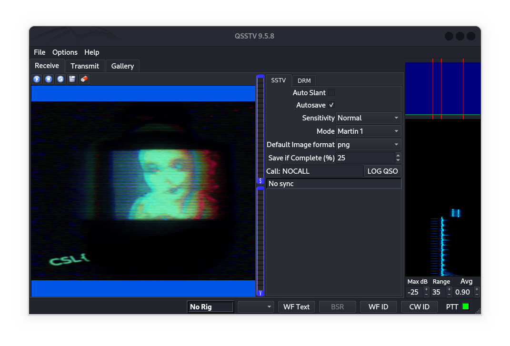

# 						Shadows Of NaSCon 2025

## 			Steganography Challenge "Signal of the Damned" Writeup

#### Category: Easy

This challenge comes with an audio file `ent1ty.wav`

Let's first look at the challenge description :-

`A mysterious signal has appeared on the airwaves, broadcasting eerie whispers and distorted images. Its origin is unknown, but those who listen report an unsettling feeling of being watched.`

So the description tells us about a signal that is broadcasting "whispers" as well as "images". This could be a hint towards SSTV (Slow Scan Television). 

------

**What is SSTV?** 
SSTV (Slow Scan Television) is a method of encoding and transmitting static images over audio signals, traditionally used by amateur radio operators. Unlike conventional TV, which sends 30 frames per second, SSTV "scans" images line-by-line using distinct audio tones, taking seconds to minutes per frame.   

**How It Works**    

1. **Image → Audio** : An image is split into horizontal lines. Each pixel’s brightness/color is converted into specific audio frequencies.  
2. **Transmission** : The audio signal (heard as warbling tones) is sent via radio waves or recorded as a WAV file.  
3. **Reception** : A decoder (hardware/software) converts the audio back into an image.

**Common SSTV Modes**    

- **Martin/Scottie** : Fast modes (16–30 seconds per image) with moderate resolution.  
- **Robot36** : 36-second transmission, widely used in CTF challenges.  
- **PD modes** : High-resolution variants (e.g., PD50, PD90).

**Applications**    

- Amateur radio communication (sharing photos over HF/VHF/UHF bands).  
- Emergency/disaster response (transmitting maps or text when digital networks fail).  
- Retro tech enthusiasts and cybersecurity (CTF challenges hiding flags in audio).

**Decoding Tools**    

- Software: **QSSTV** , **MMSSTV** , **fldigi** .  
- Online: [SSTV Online Decoder ](https://www.sstv.online/).

**Fun Fact** : SSTV was used in the 1960s–70s by astronauts to send images from space!   

------

I will be using qsstv on Kali Linux to decode the image.

`sudo apt install qsstv`

Now by default it is already on receive mode and actively scanning for SSTV signals.

Now the hint that came with the challenge is

*`How did you uncover the phantom's secret last time?`*

In the description of another Easy category steganography challenge "Inaudible Ink", a phantom operator is mentioned. That challenge was solved using (Spoiler Alert if you haven't solved it yet),

.

.

.

.

using LSB audio steganography using the tool `stegolsb`.

So let's first use the tool on this audio.

 

So `martin1`  is actually a SSTV mode, so the hint is to use this mode when decoding the SSTV audio.

> [!NOTE]
>
> Before starting the audio make sure that your recording input is your desktop and not your external microphone. To do this on Linux, open up volume control and choose Monitor mode.
>
> 

Now lets start listening, open up `QSSTV`, choose the `martin1` mode and play the audio.

When the audio finishes, the decoding process is complete and we get the decoded image which contains the flag.

------

