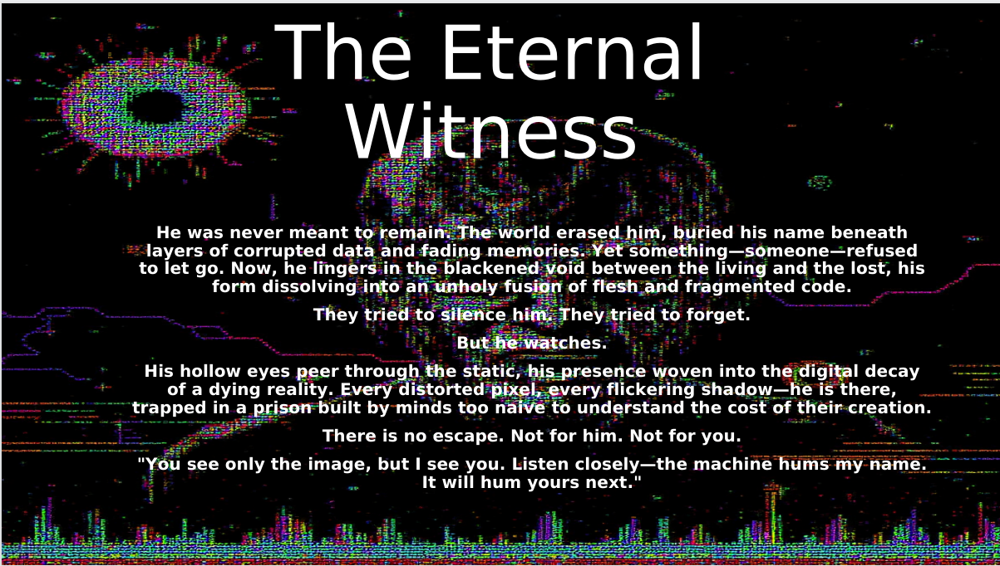
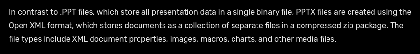
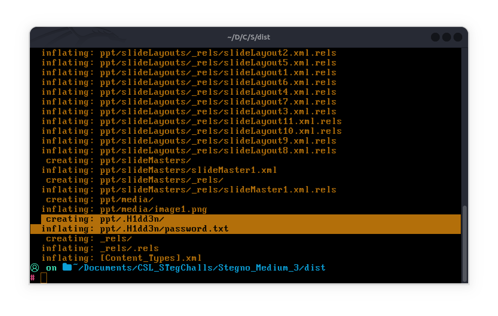
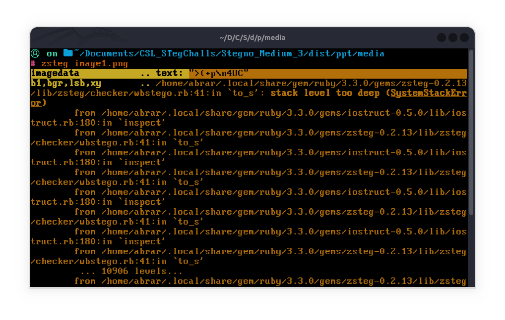
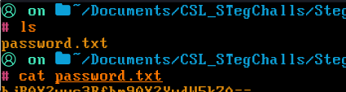
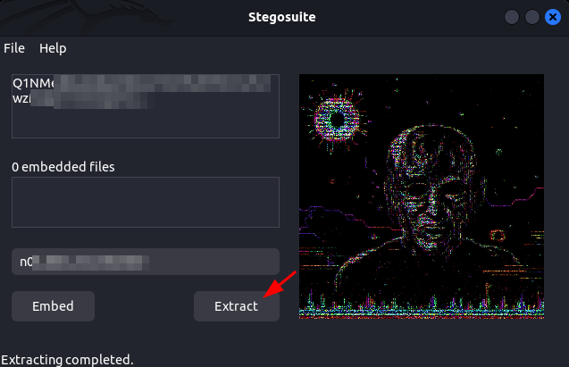

# 						Shadows Of NaSCon 2025

## 			Steganography Challenge "Under the Layer, It Wasn't Blood" Writeup

#### Category: Medium

With this challenge we get a .pptx file `unknown.pptx` which has only one slide.

Let's go back to the description

`They kept peeling, convinced the truth lay beneath. Skin gave way to sinew, sinew to something else. But it wasn’t bloo.....`

So from this vague description we can see that something is hidden and that hidden thing is behind a layer which is being *"peeled"* .

If you research a little about .pptx files you will know that

So maybe this was the layer, the supposed "compression layer" that we have to peel off.

Let's unzip the pptx file

`unzip unknown.pptx`

In the output we can clearly see a `password.txt` file. Since this is a steganography challenge it makes sense that the password is for the image in the slide which is stored at the location `ppt/media/image1.png`, (and this thing is also hinted at in the last sentence in the slide)

`"You see only the image, but I...."`

 So we only see the image but something is hidden in it.

Let's confirm if our `image1.png` is actually stenographed or not using zsteg

> [!NOTE]
>
> zsteg is a tool written in Ruby used to detect LSB steganography only in the case of PNG and BMP images. 
>
> Installation: `gem install zsteg`   (Make sure you have the `ruby` and `ruby-dev` package installed beforehand)
>
> Prerequisites: `sudo apt install ruby ruby-dev` 

From the output we can clearly see that there is some text hidden in the image which looks encrypted, so it is a confirmed stenographed image. Now lets extract the hidden text using the `password.txt` we found.

We can use stegosuite to extract the hidden data from `image1.png`

We were able to extract a base64 encoded value which when decoded gave us the flag.

------

